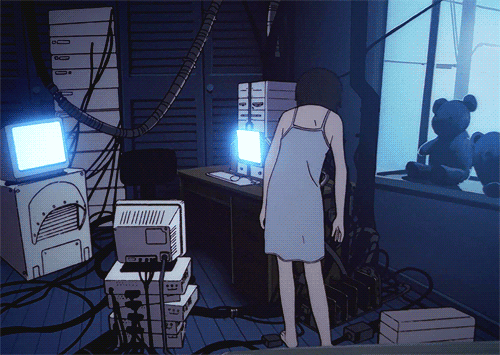

  

 

  Hello! I'm Nicole, a Computer Science student with a passion for tech that started in my childhood when I first explored Windows 98. Since then, I’ve been intrigued by technology and how it can change the world.   
  Right now, I'm diving into REST APIs, Laravel, PHP, SQL and exploring new features and tools to level up my skills.  
  <em>"N'ai pas peur d'essayer"</em>

#

<h3 align="left">✧ My Stack</h3>

  
  
  
  
  
  
  
  
  
  
  
  
  
  
  
  
  
  
  
  
  
  

<h3 align="left">✧ Connect with me!</h3>

#

  <h3>⭒ ⊹ GitHub Stats ⊹ ⭒</h3>
   
    
    
  

#
<picture align="center">
  <source media="(prefers-color-scheme: dark)" srcset="https://raw.githubusercontent.com/nicole-jc/nicole-jc/output/github-contribution-grid-snake-dark.svg">
  <source media="(prefers-color-scheme: light)" srcset="https://raw.githubusercontent.com/nicole-jc/nicole-jc/output/github-contribution-grid-snake-dark.svg">
  
</picture>

